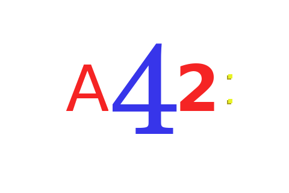

Automata42
----

This is Automata42 - a language for defining state machines.

The implementation of Automata42 I'm working on is called Simple42. As of now, Simple42 translates the source file to C(11); however, in the future I do have plans on adding more translation targets (including [Chlore](https://github.com/trap-representation/Chlore)).

I will rewrite Simple42 in Chlore soon, and open-source the project, but as of now, the only things you'll be able to find in this repository are random examples, but I hope they're enough to give people a feel of what the language is like.

Automata42 has a (WIP) specification too, link to which will ofcourse be put here in the next few months.

Automata42 is complete enough that a lexical analyzer can be written in it that performs lexical analysis on Automata42 source files. Such a lexical analyzer can be found in `examples/example0.a42`; it writes all the tokens (but keywords, which I have plans on adding support for in the future) it finds to stdout, and if the source file ends in a partial token, it exits with an exit code of 1. An example output from the lexical analyzer can be found in `examples/example0-stdout.txt`, which was generated by running the lexical analyzer on the source of the lexical analyzer itself (`examples/example0.a42`).

I also wrote a [lexical analyzer for scanning C(11) source files in Automata42](https://github.com/trap-representation/A-C11-Lexical-Analyzer).

The reason I built this before rewriting the Ehre translator entirely in Chlore, is because I wanted to generate a lexical analyzer with Automata42 for Chlore, even though I have hand-written one already - because why not.
